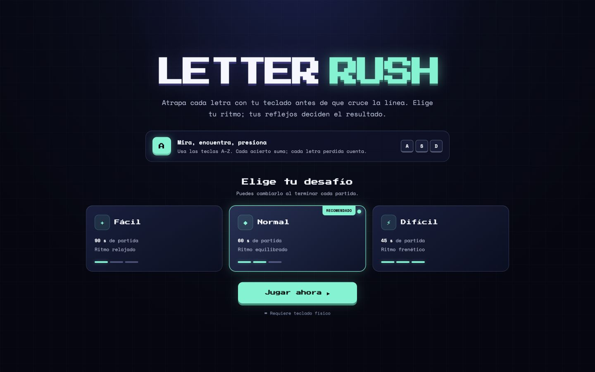
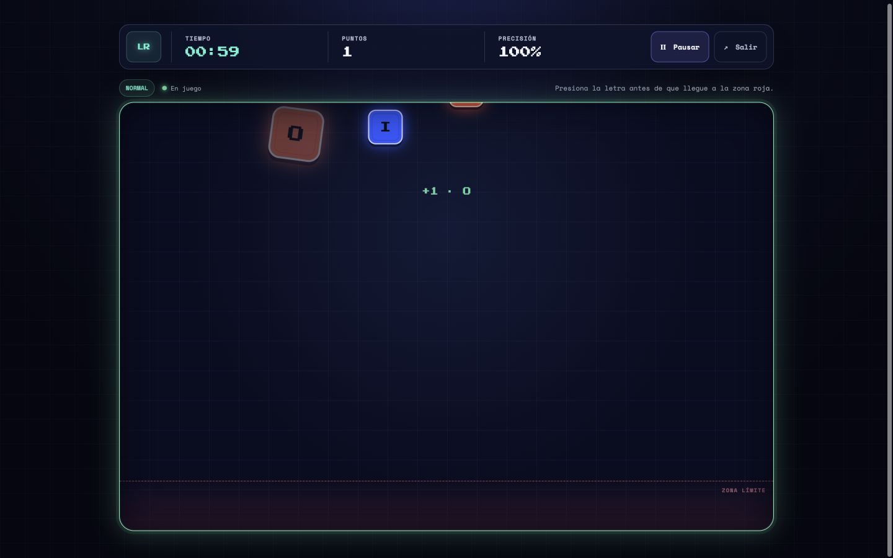
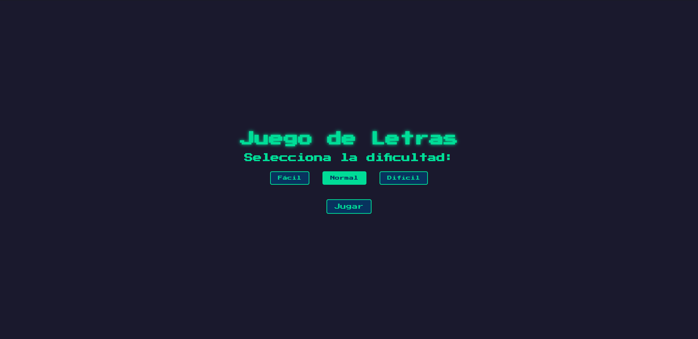
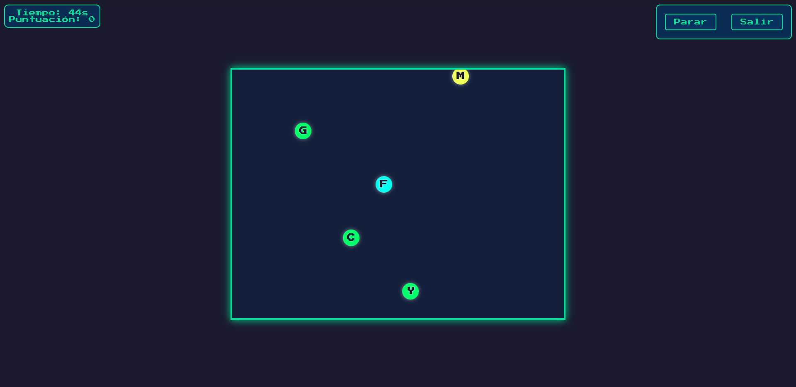

# Letter Rush

Juego de reflejos y mecanografía construido con HTML, CSS y JavaScript nativo. Las letras caen por el tablero y deben capturarse con el teclado antes de llegar a la zona límite.

## Capturas de pantalla

### Menú principal



### Partida en curso



<details>
<summary>Capturas de la versión original</summary>





</details>

## Ejecutar en local

Requiere Node.js 20+ y Python 3.

```bash
npm run dev
```

Abre [http://localhost:4173](http://localhost:4173). Los módulos ES necesitan un servidor HTTP; no abras `index.html` directamente con `file://`.

## Pruebas

```bash
npm test
```

Las pruebas usan `node:test`, sin dependencias externas.

## Arquitectura

```text
src/
├── application/
│   ├── GameController.js  # eventos, navegación y persistencia local
│   └── GameRuntime.js     # canal worker, fallback y coalescing de snapshots
├── core/
│   ├── GameEngine.js      # reglas y evolución del juego, sin DOM
│   ├── GameState.js       # fases y estado inicial
│   └── difficulty.js      # configuración de los niveles
├── ui/
│   └── GameRenderer.js    # vistas, HUD, overlays y render incremental
├── workers/
│   ├── GameWorker.js      # entrada del Web Worker
│   └── GameWorkerRuntime.js # protocolo y reloj de simulación
└── main.js                # composición de dependencias
```

El motor recibe `deltaTime`, por lo que la velocidad no depende de los FPS. La simulación corre en un único Web Worker y el hilo principal conserva sólo interacción y DOM; los snapshots se agrupan a un máximo de 60 actualizaciones por segundo. Si el navegador no permite crear workers, el mismo runtime se ejecuta localmente sin duplicar reglas. El estado sigue el flujo `menu → countdown → playing ⇄ paused → results`; la pausa conserva tiempo y posiciones. El renderer reutiliza los nodos de las letras en lugar de reconstruir todo el tablero en cada frame.

## Controles

- `A–Z`: capturar la letra correspondiente.
- `Esc`: pausar o reanudar.
- Los controles visibles permiten pausar, salir, repetir o cambiar dificultad.

## Dificultades

| Nivel | Duración | Velocidad | Aparición |
| --- | ---: | ---: | ---: |
| Fácil | 90 s | 60 px/s | cada 1000 ms |
| Normal | 60 s | 120 px/s | cada 500 ms |
| Difícil | 45 s | 180 px/s | cada 300 ms |

Cada acierto suma un punto. Una tecla alfabética incorrecta o una letra perdida resta un punto y cuenta como fallo. La mejor puntuación se conserva en el navegador.
